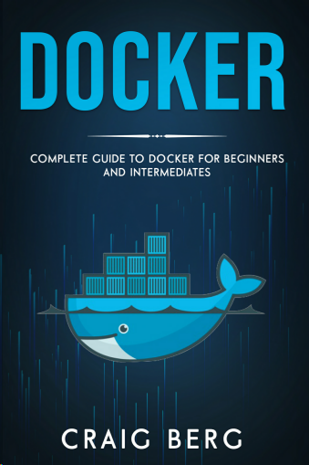
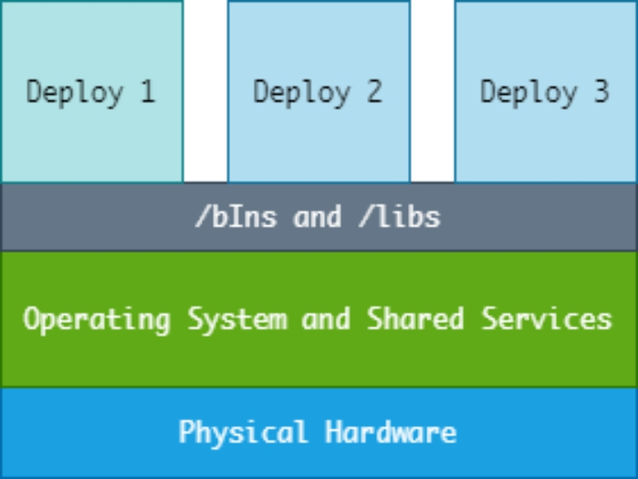
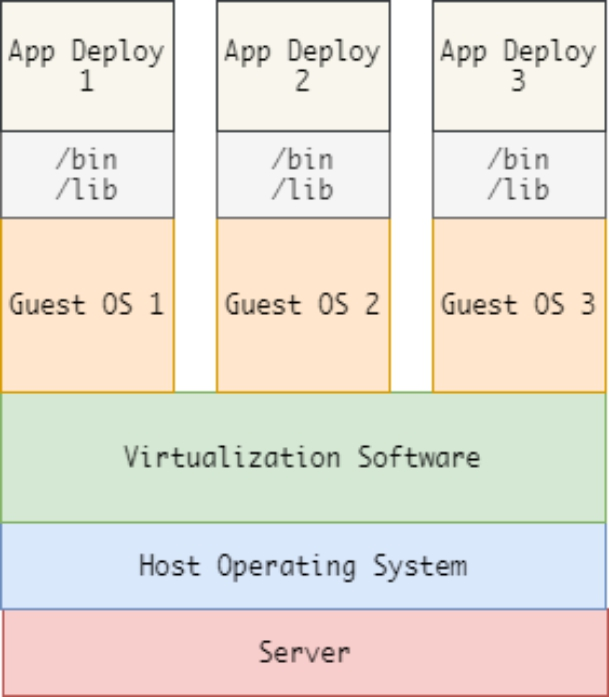
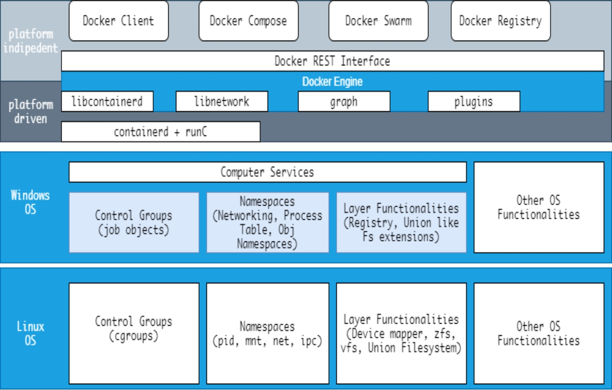
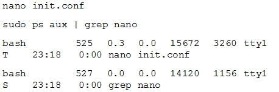

# docker

Build, Ship and Run
搭建、发送、运行
Build once，Run anywhere（搭建一次，到处能用）

三大核心概念
* 镜像（Image）
* 容器（Container）
* 仓库（Repository）
官方的Docker Hub，这也是默认的Registry，并拥有大量的高质量的官方镜像

==K8S==，就是基于容器的集群管理平台，它的全称，是kubernetes。

Kubernetes这个单词来自于希腊语，含义是舵手或领航员。K8S是它的缩写，用“8”字替代了“ubernete”这8个字符。

和Docker不同，K8S的创造者，是众人皆知的行业巨头——**Google**

然而，K8S并不是一件全新的发明。它的前身，是Google自己捣鼓了十多年的**Borg系统**。

K8S是2014年6月由Google公司正式公布出来并宣布开源的。

一个K8S系统，通常称为一个**K8S集群（Cluster）**。

这个集群主要包括两个部分：

- **一个Master节点（主节点）**
- **一群Node节点（计算节点）**

Master节点主要还是负责管理和控制。Node节点是工作负载节点，里面是具体的容器

首先来看master节点： 

其中包括：    API Server、Scheduler、Controller manager、etcd

1. API Server是整个系统的对外接口，供客户端和其它组件调用，相当于“营业厅”。

2. Scheduler负责对集群内部的资源进行调度，相当于“调度室”。

3. Controller manager负责管理控制器，相当于“大总管”。

然后是node节点：

Node节点包括Docker、kubelet、kube-proxy、Fluentd、kube-dns（可选），还有就是**Pod**。

> Pod是Kubernetes最基本的操作单元。一个Pod代表着集群中运行的一个进程，它内部封装了一个或多个紧密相关的容器。除了Pod之外，K8S还有一个Service的概念，一个Service可以看作一组提供相同服务的Pod的对外访问接口。这段不太好理解，跳过吧。

**docker** 创建容器，**Kubelet** 监视指派到它所在Node上的Pod，包括创建，修改，监控，删除等。

**Kube-proxy**，主要负责为Pod对象提供代理。

**Fluentd**，主要负责日志收集、存储与查询。

[TOC]

# 介绍

技术演化的早期，开发者将应用直接部署到运行着操作系统的物理机器上，因为单一的用户空间，应用之间只能共享运行时间。

虽然部署在物理机器上也是稳定的，但是维护却是艰难万千，当每一个宿主机都是用不同种的操作系统时，就更是难上加难了。对于开发者和应用程序来说都缺失灵活性。

正如你想象的那样，当多个需要日常维护的应用程序建立在单一的一个机器上就会造成很多问题。

考虑到在物理硬件上部署应用的局限性和整个宿主机系统资源的利用率问题，虚拟技术应运而生，自此应用开发的动态性也开始发生变化。

使用一些诸如Hyper-V ,ESX ,KVM ,VMware 等作为监管者（hypervisors）的工具，开发者能够创建虚拟机来帮助他们在硬件机器上部署宿主机操作系统（host operating systems）【相对本身的操作系统而言是guest OS 】。

虚拟机有独立的虚拟机制，应用部署在虚拟机上正是我们所说的，隔离(isolated)并孤立（standalone），也就是说，多亏了从整个运行系统中完全的隔离出来，才有可能让一个应用实例的更新和修改能在不影响其他应用的情况下完成。

下面的图解释了虚拟化。

随着技术的发展，虚拟机，这种曾经发挥过一些作用的开发工具，变得很鸡肋(redundant)，部分原因是由于虚拟机使用上的复杂，**主要的原因则是减少硬件部分参与虚拟促使技术飞速发展**（the technological changes precipitated by the process of reducing hardware emulation.）。==容器(Containers)==已经占据了曾经属于虚拟机的领地。

通过使用容器，开发者能够将应用于其环境一起打包。虽然跟虚拟机相比，容器因为其依赖宿主机操作系统而缺少一些灵活性，正如我们将要展开讨论的章节，它依然是更好的选择。

在这份Docker教程中：

* 你将读到关于Docker平台与其架构的简明介绍，包括如何在Mac，Linux，Windows 操作系统上安装Docker。
* 学习如何使用Docker 容器，包括如何检索(search)，序列化(List)，和(pull)拉取Docker镜像。
* 还会讲到如何使用容器网络，与数据管理。

还有很多很多…

这个教程的目的是让你获得极具价值的知识，让你从一个Docker新手，到玩转容器技术再到通往Docker大师之路。

# 第一章：Docker平台与架构

Docker是Solomon Hykes ，Dot Cloud 创始人 开发的一款容器化的软件，最初只是一个内部项目。在2013年五月，Docker成为了使用Apache License的开源软件。

Docker 使用了宿主机操作系统内核能够允许容器化的特性，我们可以图解Docker的平台和内核特性：

为了帮助你更好的理解Docker，我们来看一看其核心架构的组成部分：

## 命名空间（Namespaces）

命名空间是Docker容器的主要组成。有多种的命名空间，对一个一个应用来说，他们每一个都作为一个独立的板块运行。<u>通过克隆系统的命令引发命名空间的创建</u> (The creation of Namespaces happens through the clone system call ), 开发者有时也复用(attach)已经存在的命名空间，一些被Docker使用的命名空间包括：

* PID 命名空间
* 网络命名空间
* IPC 命名空间
* UTS 命名空间
* MNT 命名空间
* User 命名空间

我们来分别详细讨论一下上面每一个命名空间：

### The PID Namespace 

PID 命名空间在Linux系统中隔离了进程标识数字的空间(process Identification Numver space), 这就意味着进程使用不同PID命名空间可以使用相同的PID。

PID命名空间允许容器去分发功能（functionalities），比如阻塞(suspending) 和释放(resuming) 在容器中的进程集合。它也给开发者赋予了在进程运行于维护其原生PID的容器中的同时，将容器从一个宿主机上迁移(migrate)到另一个宿主机上的能力。

PID们在新的PID命名空间又从1开始，有点像独立的系统，**and calls to fork , vfork,or clone** 将产生带有当前命名空间内唯一PID的进程。

如上，PID命名空间允许每个容器去拥有一个独立的PID集合，每一个PID创建一个独立的**进程继承结构**（process hierarchy）。

一个“父”（或者说主）命名空间能够管理其“子”命名空间，并能做些改变他们功能的动作。然而 一个子命名空间，不能够感知到父命名空间节点的任何行为，也不能对其作出任何有影响的动作。

不同于初始（或者说根）PID命名空间，每一个嵌套命名空间都有一个父命名空间。这时所说的父命名空间指的是，使用禁共享(unshare)与克隆(clone)机制实际创建出这个命名空间的进程，所属的命名空间。这样，PID命名空间创建出一种树的结构去包含所有追溯其祖先节点最终都会追溯到根的命名空间。

如果分层有两个级别，那么在这个最高级上，我们能够看到进程在其子命名空间中用着不同的PID在运行。因此，一个进程在其子命名空间运行通常会有两个PID：一个关联父命名空间，一个关联子命名空间。==【疑问：这样如果这个分层有100层， 那岂不是每个进程都有100个PID？LInux也有PID和PPID，这之间什么联系与区别？】==

让我图解一下，如果我们开始一个进程，比如说nano，这个动作创建了一个父进程和子进程：

你可以发现更多关于PID命名空间的信息从以下的资源页面：

http://man7.org/linux/man-pages/man7/pid_namespaces.7.html

### The NET Namespace

网络命名空间是一个队网络栈的逻辑复制。其拥有独立的创建模块诸如防火墙规则，网络接口，和路由表。

默认的网络命名空间位置在:

/var/run/netns/NAME

按照惯例，一个进程通常会从其父命名空间继承所有的网络命名空间，最初的初始化进程创建的所有进程共享着相同的命名空间。

网络命名空间使得给每一个容器创建多个网络接口成为可能，也因此才能使得服务进程之间通过各自的端口进行通信。还是要注意每一个容器的**回环地址**(loopback address)是唯一的。

对于在容器中发生的网络通讯，一对特殊的网络接口在两个不同的网络命名空间中被创建出来，允许其在各自的接口处进行通信。每个接口都驻留在一个容器中，而另一个驻留在宿主机操作系统中。容器的接口是eth0，宿主机接口会分发一个随机但唯一的名字。

接口之间通过网桥(network bridge)进行相互关联(interlink)，网桥，在多数情况下是允许在容器与分组路由(packets routes )间进行通信的docker0。

学习更多关于网络命名空间，查看这个LInux 编程者的页面：

http://man7.org/linux/man-pages/man8/ip-netns.8.html

