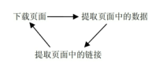
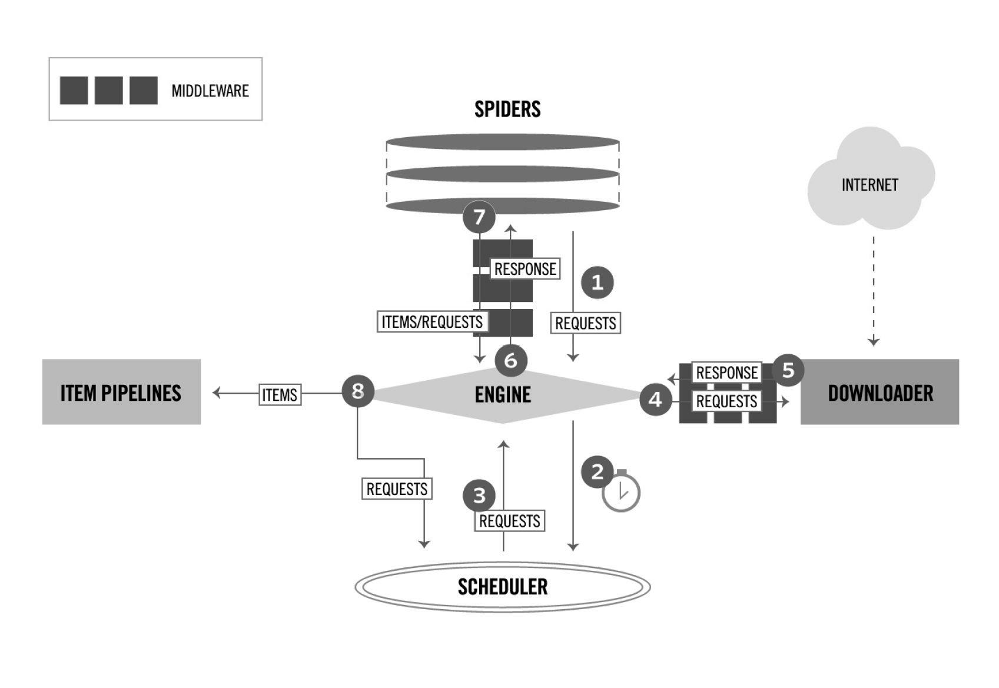
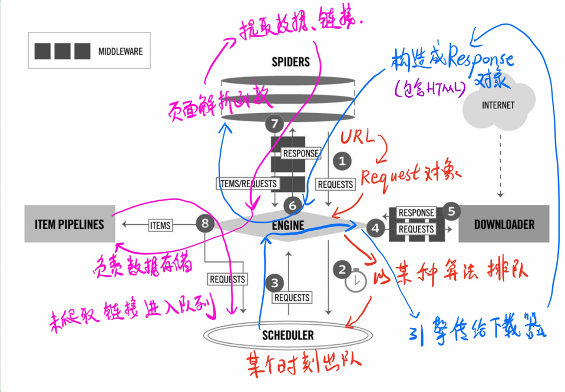
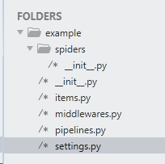

# scrapy 

使用Python，基于Twisted框架，开源网络爬虫框架。

##  1 、基本思路


自动爬取网站内容信息的程序，网络机器人。广泛应用于搜索引擎，数据挖掘等领域。



网页的本质是HTML文本，爬取之前，根据URL下载网页。

提取页面中的数据。CSV，JSON等文件，或者MySQL、MongoDB等数据库。

页面中的链接进行提取。要考虑，URL去重、网页搜索策略（广度优先或深度优先）、==爬虫访问边界限定==


## Scrapy 的原理：





如果各个组件是器官，  Request Response 是血液，Item 就是代谢产物。

| 组件          | 描述                                                 | 类型     |
| ------------- | ---------------------------------------------------- | -------- |
| ENGINE        | 引擎，框架核心，控制所有组件协同工作；               | 内部组件 |
| SCHEDULER     | 调度器，负责对SPIDER提交的下载请求进行调度；         | 内部组件 |
| DOWNLOADER    | 下载器，负责下载页面（发送HTTP请求、接受HTTP相应）   | 内部组件 |
| ==SPIDER==    | 爬虫，负责提取页面中的数据，产生对新页面的下载请求。 | 用户实现 |
| MIDDLEWARE    | 中间件，负责对Request对象和Response对象进行处理。    | 可选组件 |
| ITEM PIPELINE | 数据管道，负责对爬取到的数据进行处理。               | 可选组件 |

### Request 对象

【用来描述一个HTTP请求】

```Request(url,[,callback,method='GET',headers,body,cooies,meta,encoding='utf-8',priority=0,dont_filter=False,errback])```


### 安装

`pip install scrapy`

```python 
import scrapy 
scrapy.version_info
```

在shell 中，执行  `scrapy`

两项都成功显示，说明安装成功。

### 创建项目

`scrapy startproject example`



爬虫编写之前，需要对页面进行分析。分为，**数据信息**，**链接信息**

实现Spider  是实现一个scrapy.Spider 的子类


```python
# -*- coding:utf-8 -*-
import scrapy
class BookSpider(scrapy.Spider):
    # 每一个爬虫的唯一标识（一个项目中不能重名）  一个scrapy 项目可能有多个爬虫
    name = "books"
    # 定义爬虫爬取的起始点，起始点可以使多个，这里只有一个
    start_urls = ['http://books.toscrape.com/']
    
    def parse(self,response):  # 页面解析函数  通常有两个任务，提取页面中数据、链接
        # 提取数据
        # 每一本书的信息在 <article class="product_pod">中，我们是用
        # css() 方法找到所有这样的article 元素，并依次迭代
        for book in response.css('article.product_pod'):
            # 书名信息在 article > h3 > a 元素的title属性里
            # 例如： <a title="A Light in the Attic"> A Light in the ...</a>
            name = book.xpath('./h3/a/@title').extract_first()
            
            # 书价信息在<p class="price_color">的 TEXT中。
            #例如 <p class="price_color">$51.77</p>
            price = book.css('p.price_color::text ').extract_first()
            yield {
                'name':name,
                'price':price,
            }
            # 提取链接
    	#下一页的 url 在ul.pager > li.next > a 里面
    	# 例如 : <li class="next"><a href="catalogue/page-2.html">next</a><\li>
    	next_url = response.css('ul.pager li.next a::attr(href)').extract_first()
    	if next_url:
    		# 如果找到下一页的URL ,得到绝对路径，构造新的Request 对象
    		next_url = response.urljoin(next_url)
       		yield scrapy.Request(next_url,callback=self.parse)


```

页面解析函数通常被实现成一个生成器函数，

每一项从页面中提取的数据

每一个对链接页面的下载请求==都由yield语句提交给Scrapy引擎==


什么是生成器函数？ yield 什么含义？ 

### 运行爬虫

scrapy crawl books -o books.csv 

```bash 
scrapy crawl <SPIDER_NAME> 
```

